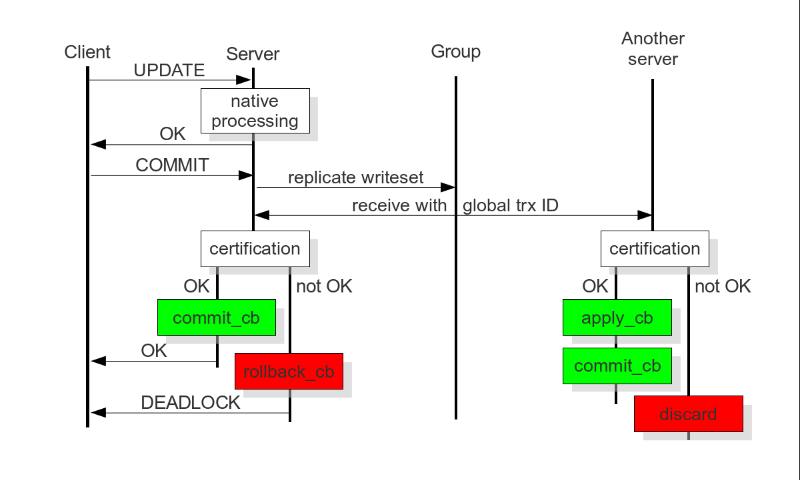

# Multi-Source Replication

Multi-source replication means that you can write to any node
and be sure that the write will be consistent for all nodes in the cluster.
This is different from regular MySQL replication,
where you have to apply writes to source to ensure that it will be synced.

With multi-source replication any write is either committed on all nodes
or not committed at all.
The following diagram shows how it works for two nodes,
but the same logic is applied with any number of nodes in the cluster:

All queries are executed locally on the node,
and there is special handling only on `COMMIT`.
When the `COMMIT` query is issued,
the transaction has to pass certification on all nodes.
If it does not pass, you will receive `ERROR` as the response for that query.
After that, the transaction is applied on the local node.

Response time of `COMMIT` includes the following:

* Network round-trip time

* Certification time

* Local applying

!!! note

    Applying the transaction on remote nodes
    does not affect the response time of `COMMIT`,
    because it happens in the background after the response on certification. 

There are two important consequences of this architecture:

* Several appliers can be used in parallel.
  This enables truly parallel replication.
  A replica can have many parallel threads configured
  using the `wsrep_slave_threads` variable.

* There might be a small period of time when a replica is out of sync.
  This happens because the source may apply events faster than the replica.
  And if you do read from the replica,
  you may read the data that has not changed yet.
  You can see that from the diagram.

  However, this behavior can be changed
  by setting the `wsrep_causal_reads=ON` variable.
  In this case, the read on the replica will wait until the event is applied
  (this will obviously increase the response time of the read).
  The gap between the replica and the source is the reason
  why this replication is called *virtually synchronous replication*,
  and not *real synchronous replication*.

The described behavior of `COMMIT` also has another serious implication.
If you run write transactions to two different nodes,
the cluster will use an [optimistic locking model](http://en.wikipedia.org/wiki/Optimistic_concurrency_control).
This means a transaction will not check on possible locking conflicts
during the individual queries, but rather on the `COMMIT` stage,
and you may get `ERROR` response on `COMMIT`.

This is mentioned because it is one of the incompatibilities
with regular *InnoDB* that you might experience.
With InnoDB, `DEADLOCK` and `LOCK TIMEOUT` errors usually happen
in response to a particular query, but not on `COMMIT`.
It is good practice to check the error codes after a `COMMIT` query,
but there are still many applications that do not do that.

If you plan to use multi-source replication
and run write transactions on several nodes,
you may need to make sure you handle the responses on `COMMIT` queries.
